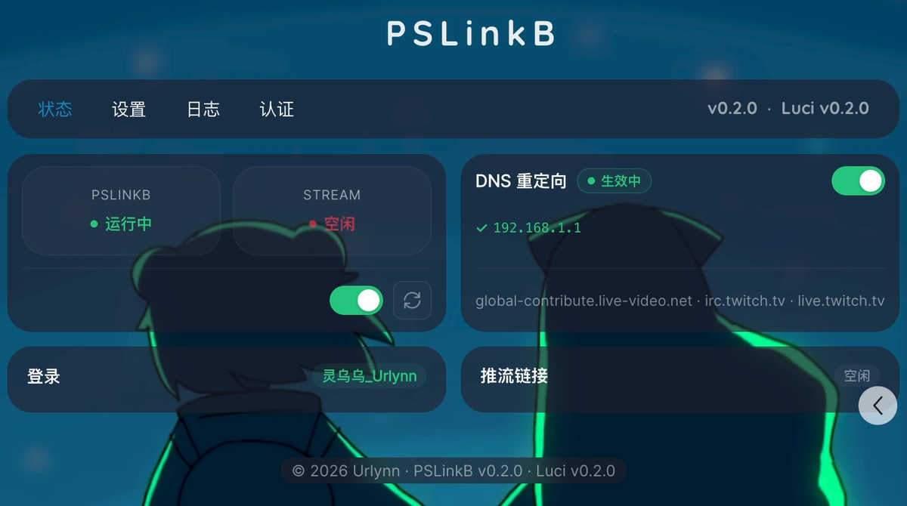

**使用教程：**[PSLinkB - PS5一键自动推流B站·弹幕同步·自动开播·Rust·开源](https://b23.tv/AkiN2Jq)

#### DNS 重定向
```shell
ingest.global-contribute.live-video.net
irc.twitch.tv
```

## 安装教程
### OpenWrt

**luci-app-pslinkb**

```shell
# For apk
apk add --allow-untrusted luci-app-pslinkb-0.3.0.apk
# For opkg
opkg install luci-app-pslinkb-0.3.0.ipk
```

**x86_64 / aarch64_generic**

```shell
# For apk
apk add --allow-untrusted pslinkb-0.3.3-{arch}-openwrt.apk
# For opkg
opkg update
opkg install pslinkb-0.3.3-{arch}-openwrt.ipk
```
**aarch64_cortex-a53 / aarch64_cortex-a72 / aarch64_cortex-a76**

```shell
tar xzf pslinkb-0.3.3-aarch64-openwrt.tar.gz -C /
```

**使用 Web 界面一键安装：**



### 桌面用户

#### 使用双击运行 ?

> Windows 11 用户请将 系统 `默认终端` 更改为 `Windows 终端`

#### 使用命令行参数

```shell
Usage: pslinkb [OPTIONS]

Options:
  -C, --config <FILE>     配置文件路径 [default: ~/.config/pslinkb.toml]
  -c, --cookie <COOKIE>   Cookie 字符串
  -r, --room-id <ROOM_ID> 直播间 ID
  -t, --title <TITLE>     直播间 标题
  -a, --area <AREA>       直播间 分区 ID（默认 "237" - 单机游戏 - 主机游戏）
  -m, --mode <MODE>       开播模式: auto (Default) or manual
  -d, --dns <DNS>         自定义上游 DNS (IP 或 IP:端口)
      --debug             开启调试日志
  -h, --help              Print help
  -V, --version           Print version
```

#### 使用配置文件

```shell
# pslinkb.toml
dns_proxy = true    # 自动 DNS 代理开关

[live]
room_id = 3151244   # 直播间 ID
title = ""          # 直播间标题 - 留空即保持默认
area_v2 = "237"     # 分区 ID (默认 237 - 单机游戏 - 主机游戏)
live_mode = "auto"  # auto = 一键开播 | manual = 手动开播

[[auth.cookies]]    # 扫码登录后自动写入 Cookie 字段
```


## 更新日志

`pslinkb` -  **v0.3.3**

- 开播无需人脸验证
- 自动同步 Twitch 标题到 B站直播间
- PS5 断网、断电检测 -> 关播回 Idle
- 桌面模式: cli 增加 --debug 调试参数
- OpenWrt 模式: 支持直播间、分区热更新

`luci-app-pslinkb` - **v0.3.0**

- Lua + CBI 架构 -> ucode + JavaScript 视图
- 未安装检测、版本检查、自动更新与安装
- 手动开播模式 - 推流链接显示 + 一键复制
- 直播标题、分区支持动态更新
- 丰富开关动画、状态指示、加载动画

> 详细更新日志请见 [commit 历史](https://github.com/urlynn/PSLinkB/commits/main)

## Todo
- [ ] 内置 twitch 直连
- [x]  v0.3.3 - 开播无需人脸验证
- [x]  v0.3.3 - 动态更新直播标题、直播分区
- [x] v0.3.3 - 直播标题使用 PS5 标题
- [ ] 各文档补充

## 源代码树

```shell
src/
├── main.rs           # cli.rs, config.rs, lib.rs
├── runtime/          # system, spawn, run, dispatch
├── core/             # state, event, effect, error, channel, twitch
│   └── bilibili      # biliapi.rs, blive.rs 
├── actors/           # rtmp, ffmpeg, irc_server, irc_client, danmaku
├── auth/             # init.rs, login.rs
├── dns/              # check, desktop, openwrt
├── ffmpeg/           # mod.rs, glue.c, stream_copy.c
├── openwrt/          # luci.rs
└── utils/            # log, danmulog, ip

luci-app-pslinkb/
├── htdocs/.../view/pslinkb/  # status.js log.js auth.js config.js
├── root/.../rpcd/            # ucode + ACL
├── root/.../luci/menu.d/     # menu
└── root/.../lua/luci/i18n/   # i18n .lmo
```

## Feature Flags

| Flag | 依赖 | 作用 |
|------|------|------|
| `channel-mpsc` | — | 单消费者弹幕通道 |
| `channel-broadcast` | — | 多消费者弹幕通道 |
| `cli` | `clap`, `toml`, `qrcode`, `image`, `url` | CLI + TOML + QR 扫码 |
| `openwrt` | — | UCI 配置 + 文件 IPC |
| `ffi-ffmpeg` | — | `ffi` ffmpeg 绑定 |
| `external-ffmpeg` | — | `stream copy`子进程 |
| `dns-redirect` | `hickory-proto` | 内置 DNS 代理 or 检查 |
| `protobuf-support` | `blivemsg/protobuf-support` | 详见 [blivemsg](https://crates.io/crates/blivemsg) |

> **注意**：`channel-mpsc` 与 `channel-broadcast` 互斥、`cli` 与 `openwrt` 互斥。

## 构建配置

| 平台 | Binary | Features |
|------|--------|----------|
| macOS | `pslinkb`@`FFI` | `cli`,`channel-broadcast`,`ffi-ffmpeg`,`dns-redirect`  |
| Linux portable | `pslinkb`@`FFI` | `cli`,`channel-mpsc`,`ffi-ffmpeg`,`dns-redirect` |
| Linux bundle | `pslinkb` + `stream` | `cli`,`channel-mpsc`,`external-ffmpeg`,`dns-redirect` |
| Alpine / DEB / Arch | `pslinkb` + `stream` | `cli`,`channel-mpsc`,`external-ffmpeg`,`dns-redirect` |
| OpenWRT | `pslinkb` + `stream` | `openwrt`,`channel-mpsc`,`external-ffmpeg` |
| Windows | `pslinkb` + `stream` | `cli`,`channel-broadcast`,`external-ffmpeg`,`dns-redirect` |
### 自构建 FFmpeg 指南

> 静态库目录：`ffbuild/{platform}-{arch}/lib/`
>
> - 需要 `libavformat.a`,  `libavcodec.a`,  `libavutil.a`
>
> 头文件目录：`ffbuild/{platform}-{arch}/include/`


## 作者吐槽

> 想让 PS5 直播变得全自动化，于是决定用 Rust 来开发一套完整的方案——
>覆盖了 DNS 重写、开关播、推流、弹幕同步等全流程。
> 
> 开发完 `PSLinkB v1.0` ，因 Rust 生态里没有能用的B 站直播弹幕库，只好从头造轮子——也就是 [`blivemsg`](https://github.com/urlynn/blivemsg)。 
>最初不知道有整理好的 B 站 API 文档，就像在黑箱里摸索尝试，收到的消息先看原始数据，再一个个字段解析。经过了无数次重构，最后 `blivemsg` 这个项目，花的时间已经远超初版 `PSLinkB` 本身。
> 
> ---
> 
> 开发 RTMP 服务的时候，先用 `rtmp-rs` 写完了除推流外的全部功能，做完了才发现它不支持 push。
> 之后陆续尝试了 `odv-rtmp`、`rml-rtmp`、`mio`……全都推不上 B 站。
> 折腾许久，最后解决方案让人哭笑不得——自己精简编译了个 923KB 的 ffmpeg。
>
> 双二进制不方便，想深度集成，结果`ffmpeg-next` 不兼容新版 ffmpeg 的 API；
>而 `ffmpeg-sys-next` 的强制要求，不是你适配它的库结构，就是改它的源码。
> 与其改别人的源码来适配我们，还不如自己写呢，手写 FFI 方案就此来临。
> 
> 引入 unsafe 又带来新的问题——ffmpeg 一崩，整个进程跟着崩。
> external 模式绕了一圈，又回到了外置 ffmpeg？
> 最后想通了——既然只需要 stream copy 这一个功能，为何不手写 `stream_copy.c`，只链接 `avformat`、`avcodec`、`avutil` 三个库。
> 923KB → 633KB，这回儿终于满意了。

## 特别致谢

[urlynn/blivemsg](https://github.com/urlynn/blivemsg) - 轻量高效的 B 站 直播间消息库

[IceNoproblem/PS5BiliDanmaku](https://github.com/IceNoproblem/PS5BiliDanmaku) - 灵感来源

[GamerNoTitle/BiliLive-Utility](https://github.com/GamerNoTitle/BiliLive-Utility) - Electron 开播模式参考

[SocialSisterYi/bilibili-API-collect]() - Biliblili API 参考
